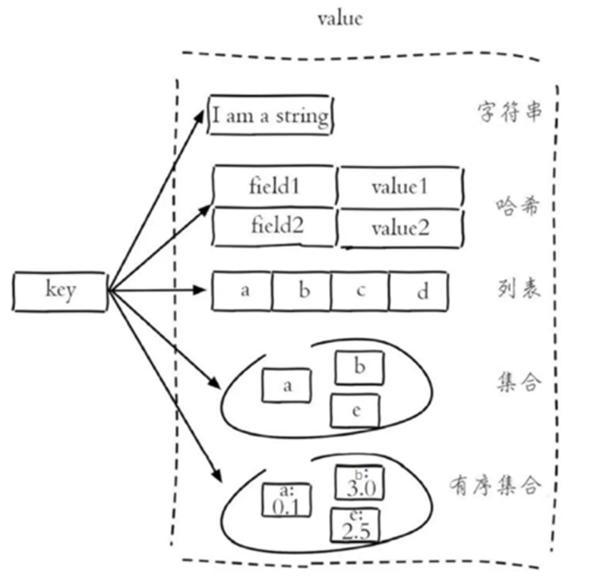

# 1、简介

---

## 1.1 基本信息

Redis是一个基于**内存**的 key-value 结构数据库。

- 基于内存存储，读写性能高
- 适合存储热点数据（热点商品、资讯、新闻）

## 1.2 数据类型

Redis存储的是key-value结构的数据，其中key是字符串类型，value有5种常用的数据类型：

- 字符串 string
- 哈希 hash
- 列表 list
- 集合 set
- 有序集合 sorted set / zset

## 1.3 常用命令

- SET key value 设置指定key的值
- GET key 获取指定key的值
- SETEX key seconds value 设置指定key的值，并将 key 的过期时间设为 seconds 秒
- SETNX key value 只有在 key 不存在时设置 key 的值

## 1.4 哈希操作

- HSET key field value  将哈希表 key 中的字段 field 的值设为 value
- HGET key field  获取存储在哈希表中指定字段的值
- HDEL key field 删除存储在哈希表中的指定字段
- HKEYS key  获取哈希表中所有字段
- HVALS key  获取哈希表中所有值

## 1.5 列表操作

类似队列，先进先出，列表采用头插法的方式实现

- LPUSH key value1 [value2]  将一个或多个值插入到列表头部(左边)
- LRANGE key start stop  获取列表指定范围内的元素
- RPOP key  移除并获取列表最后一个元素(右边)
- LLEN key  获取列表长度

## 1.6 无序集合操作

- SADD key member1 [member2]  向集合添加一个或多个成员
- SMEMBERS key  返回集合中的所有成员
- SCARD key  获取集合的成员数
- SINTER key1 [key2]  返回给定所有集合的交集
- SUNION key1 [key2]  返回所有给定集合的并集
- SREM key member1 [member2]  删除集合中一个或多个成员

## 1.7 有序集合操作

- ZADD key score1 member1 [score2 member2]  向有序集合添加一个或多个成员
- ZRANGE key start stop [WITHSCORES]  通过索引区间返回有序集合中指定区间内的成员
- ZINCRBY key increment member  有序集合中对指定成员的分数加上增量 increment
- ZREM key member [member ...]  移除有序集合中的一个或多个成员

## 1.8 通用命令

- KEYS pattern  查找所有符合给定模式( pattern)的 key 
- EXISTS key  检查给定 key 是否存在
- TYPE key  返回 key 所储存的值的类型
- DEL key  该命令用于在 key 存在是删除 key

# 2、Spring Cache

---

Spring Cache 提供了一层抽象，底层可以切换不同的缓存实现，例如：

1. EHCache
2. Caffeine
3. Redis

| **注解**       | **说明**                                                     |
| -------------- | ------------------------------------------------------------ |
| @EnableCaching | 开启缓存注解功能，通常加在启动类上                           |
| @Cacheable     | 在方法执行前先查询缓存中是否有数据，如果有数据，则直接返回缓存数据；如果没有缓存数据，调用方法并将方法返回值放到缓存中 |
| @CachePut      | 将方法的返回值放到缓存中                                     |
| @CacheEvict    | 将一条或多条数据从缓存中删除                                 |